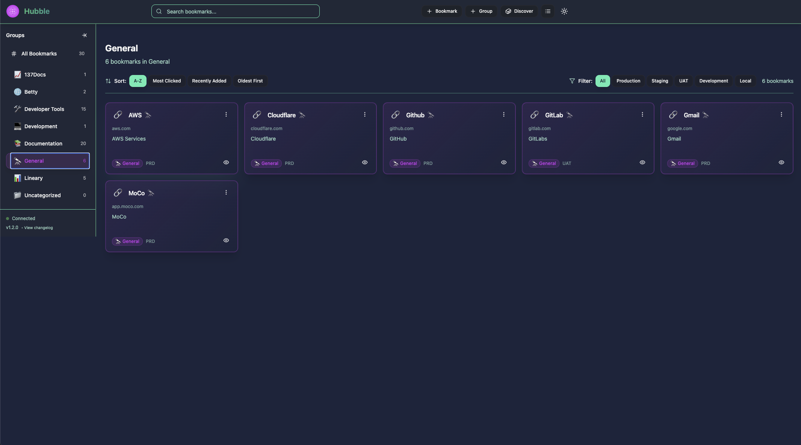
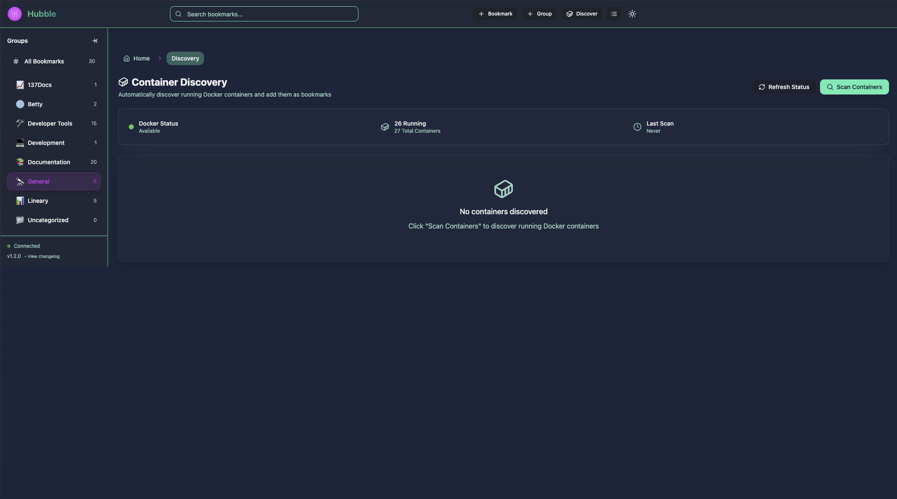

# 🔭 Hubble - Modern Bookmark Dashboard with MCP Integration

<div align="center">
  
  
  [](https://creativecommons.org/licenses/by-nc/4.0/)
  [](https://www.docker.com/)
  [](https://modelcontextprotocol.io/)
  
  **A powerful, self-hosted bookmark dashboard designed for developers and teams**
  
  [Features](#-features) • [Quick Start](#-quick-start) • [Documentation](#-documentation) • [Contributing](#-contributing)
</div>

---

## 📖 About Hubble

Hubble is a modern, self-hosted bookmark management system that goes beyond traditional bookmarking. Built specifically for developers and technical teams, it provides intelligent organization, automatic service discovery, and programmatic access through the Model Context Protocol (MCP).

Whether you're managing development environments, documentation links, or team resources, Hubble provides a centralized, beautiful, and efficient way to organize and access your digital resources.

## ✨ Key Features

### 🎯 Core Functionality
- **Hierarchical Organization** - Groups and subgroups for logical bookmark structure
- **Smart Bookmark Cards** - Rich previews with favicons, descriptions, and metadata
- **Multiple Views** - Switch between card grid and compact list views
- **Dark/Light Themes** - Beautiful UI with royal navy blue dark theme
- **Real-time Updates** - WebSocket-powered instant synchronization
- **Collapsible Sidebar** - Maximize screen space when needed

### 🤖 Advanced Features
- **MCP Integration** - Programmatic bookmark management via Claude and other MCP clients
- **Docker Discovery** - Automatically detect and import Docker containers as bookmarks
- **Environment Tagging** - Organize by development, staging, UAT, and production
- **Health Monitoring** - Track bookmark availability and dead links
- **Click Analytics** - Understand which resources are most used
- **Search & Filter** - Fast fuzzy search across all bookmarks

### 🚀 Developer-Focused
- **No Authentication Required** - Designed for internal networks
- **SQLite Database** - Simple, portable, no external dependencies
- **Docker Compose Ready** - Single command deployment
- **REST API** - Full programmatic access
- **Bulk Operations** - Import/export capabilities

## 📸 Screenshots

<div align="center">
  
  <p><em>Main dashboard showing bookmark cards with environment tags and quick actions</em></p>
  
  
  <p><em>Documentation group with 20 developer resources organized in list view</em></p>
  
  
  <p><em>Container Discovery - Automatically detect and import Docker containers as bookmarks</em></p>
</div>

## 🚀 Quick Start

### Prerequisites
- Docker and Docker Compose
- Node.js 20+ (for development)
- Git

### Installation

1. **Clone the repository**
```bash
git clone git@github.com:48Nauts-Operator/hubble.git
cd hubble
```

2. **Configure environment**
```bash
cp .env.example .env
# Edit .env with your settings
```

3. **Start with Docker Compose**
```bash
docker-compose up -d
```

4. **Access Hubble**
```
http://localhost:8888
```

That's it! Hubble is now running on your system.

## 🔧 Configuration

### Ports
- **8888** - Frontend (React application)
- **8889** - Backend API (Express.js)
- **9900** - MCP Server (Model Context Protocol)

### Environment Variables
```env
# Frontend
VITE_API_URL=http://localhost:8889
VITE_WS_URL=ws://localhost:8889

# Backend
NODE_ENV=production
DATABASE_URL=/data/hubble.db
PORT=5000

# MCP Server
MCP_PORT=9900
API_URL=http://backend:5000
```

### Nginx Reverse Proxy (Optional)
For production deployment with a domain:

```nginx
server {
    server_name hubble.yourdomain.com;
    
    location / {
        proxy_pass http://localhost:8888;
        proxy_http_version 1.1;
        proxy_set_header Upgrade $http_upgrade;
        proxy_set_header Connection 'upgrade';
        proxy_set_header Host $host;
        proxy_cache_bypass $http_upgrade;
    }
    
    location /api {
        proxy_pass http://localhost:8889;
    }
}
```

## 📚 Documentation

### Architecture Overview

```
Hubble/
├── frontend/          # React 18 + TypeScript + Vite
│   ├── src/
│   │   ├── components/   # UI components
│   │   ├── stores/       # Zustand state management
│   │   └── services/     # API clients
│   └── dist/            # Production build
│
├── backend/           # Express.js API server
│   ├── routes/          # API endpoints
│   ├── services/        # Business logic
│   └── database/        # SQLite schema
│
├── mcp-server/        # MCP protocol server
│   └── index.js         # MCP implementation
│
└── docker-compose.yml # Container orchestration
```

### Technology Stack

**Frontend:**
- React 18 with TypeScript
- Tailwind CSS + Radix UI
- Framer Motion animations
- Zustand state management
- Vite build tool

**Backend:**
- Node.js + Express.js
- SQLite database
- Socket.io for WebSocket
- Docker container integration

**Infrastructure:**
- Docker & Docker Compose
- Nginx reverse proxy
- MCP protocol support

## 🤝 Contributing

We welcome contributions from the community! Hubble is built by developers, for developers.

### How to Contribute

1. **Fork the repository**
2. **Create a feature branch** (`git checkout -b feature/amazing-feature`)
3. **Commit your changes** (`git commit -m 'Add amazing feature'`)
4. **Push to the branch** (`git push origin feature/amazing-feature`)
5. **Open a Pull Request**

### Contribution Guidelines

- Follow existing code style and conventions
- Write clear commit messages
- Add tests for new features
- Update documentation as needed
- Be respectful and constructive in discussions

See [CONTRIBUTING.md](CONTRIBUTING.md) for detailed guidelines.

### Ideas for Contribution

- 🎨 UI/UX improvements
- 🌍 Internationalization
- 🔌 Browser extensions
- 📊 Advanced analytics
- 🔄 Sync with other bookmark services
- 🏷️ Smart tagging with AI
- 📱 Mobile responsive improvements
- 🔐 Optional authentication layer
- 🎯 Bookmark recommendations
- 📦 Additional import/export formats

## 📄 License

This project is licensed under the **Creative Commons Attribution-NonCommercial 4.0 International License** (CC BY-NC 4.0).

### What this means:

✅ **You CAN:**
- Use Hubble for personal projects
- Use Hubble within your organization
- Modify and distribute the code
- Share with the community

❌ **You CANNOT:**
- Use Hubble for commercial purposes
- Sell Hubble or services based on it
- Use in commercial products

### Disclaimer

THIS SOFTWARE IS PROVIDED "AS IS", WITHOUT WARRANTY OF ANY KIND, EXPRESS OR IMPLIED. USE AT YOUR OWN RISK. NO OFFICIAL SUPPORT IS PROVIDED.

See [LICENSE](LICENSE) for the full license text.

## 🙏 Acknowledgments

### Built With Love By
- The [48Nauts](https://github.com/48Nauts-Operator) team
- Contributors from the open source community

### Special Thanks
- The Model Context Protocol team at Anthropic
- The React and Node.js communities
- All contributors and users who make Hubble better

### Technologies Used
- [React](https://reactjs.org/) - UI Framework
- [Tailwind CSS](https://tailwindcss.com/) - Styling
- [Express.js](https://expressjs.com/) - Backend Framework
- [SQLite](https://www.sqlite.org/) - Database
- [Docker](https://www.docker.com/) - Containerization
- [Socket.io](https://socket.io/) - Real-time Communication

## 🚦 Roadmap

### Current Version: 1.2.0

### Upcoming Features
- [ ] Shareable bookmark views
- [ ] Team workspaces
- [ ] Advanced search filters
- [ ] Bookmark import from browsers
- [ ] API rate limiting
- [ ] Backup and restore
- [ ] PWA support
- [ ] Keyboard shortcuts
- [ ] Bulk editing tools
- [ ] Custom themes

## 💬 Community

- **Issues**: [GitHub Issues](https://github.com/48Nauts-Operator/hubble/issues)
- **Discussions**: [GitHub Discussions](https://github.com/48Nauts-Operator/hubble/discussions)
- **Pull Requests**: [GitHub PRs](https://github.com/48Nauts-Operator/hubble/pulls)

## 🐛 Reporting Issues

Found a bug? Have a suggestion? Please check existing issues first, then create a new issue with:
- Clear description
- Steps to reproduce
- Expected vs actual behavior
- System information
- Screenshots if applicable

## 🌟 Star History

If you find Hubble useful, please consider giving it a star ⭐ on GitHub!

---

<div align="center">
  <strong>Built with ❤️ for the developer community</strong>
  <br>
  <em>Making bookmark management beautiful and efficient</em>
</div>