# Hubble - Intelligent Bookmark Dashboard with MCP Integration

## 🎯 Executive Summary

Hubble is a modern, self-hosted bookmark dashboard that solves the problem of bookmark chaos across multiple projects and services. Unlike Homarr (which focuses on home lab services), Hubble is designed for developers and teams managing multiple projects, with programmatic access via MCP for automatic bookmark synchronization. Named after the telescope that helps us see distant objects clearly, Hubble brings all your project endpoints into clear view.

---

## 🚀 Core Concept

### The Problem
- Bookmarks scattered across browsers, projects, and documentation
- No programmatic way for projects to register their URLs
- Existing solutions (Homarr, Heimdall) are too focused on home lab/media servers
- Manual bookmark management becomes overwhelming at scale

### Our Solution
- **Centralized Dashboard**: Beautiful, fast, modern UI for all project links
- **MCP Integration**: Projects can automatically register/update their URLs
- **Smart Organization**: Auto-categorization, tags, and search
- **Developer-First**: Built for development teams, not home labs

---

## 🎨 Design Philosophy

### Visual Design Principles
```
Modern Minimalism + Functional Beauty
- Clean lines, ample whitespace
- Subtle animations and micro-interactions  
- Focus on content, not chrome
- Accessibility first (WCAG AAA)
```

### UI/UX Improvements Over Homarr

| Homarr Issues | Nauty Solution |
|--------------|-------------------|
| Cluttered interface | Clean, spacious design with breathing room |
| Generic home lab focus | Developer-centric with project management |
| Static configuration | Dynamic MCP-driven updates |
| Limited search | Fuzzy search with instant results |
| Basic icons | Rich icon library + favicon fallback |
| Fixed layouts | Adaptive grid with drag-and-drop |

---

## 🏗️ Architecture

### System Architecture

```mermaid
graph TB
    subgraph "Frontend"
        UI[React Dashboard]
        WS[WebSocket Client]
    end
    
    subgraph "Backend"
        API[REST API]
        WSS[WebSocket Server]
        MCP[MCP Server]
        DB[(SQLite DB)]
    end
    
    subgraph "External"
        P1[Project 1]
        P2[Project 2]
        P3[Project N]
    end
    
    UI <--> API
    UI <--> WS
    WS <--> WSS
    API <--> DB
    MCP <--> DB
    P1 --> MCP
    P2 --> MCP
    P3 --> MCP
```


### Tech Stack

```yaml
Frontend:
  Framework: React 18 with TypeScript
  Styling: Tailwind CSS + Radix UI
  State: Zustand (lightweight)
  Icons: Lucide Icons + dynamic favicons
  Search: Fuse.js for fuzzy search
  Animations: Framer Motion

Backend:
  Runtime: Node.js 20+
  Framework: Express.js
  Database: SQLite (portable, simple)
  Websocket: Socket.io
  MCP: Custom MCP server implementation
  
DevOps:
  Container: Docker + Docker Compose
  Proxy: Nginx for reverse proxy
  Storage: Local volumes for persistence
```

---

## 💡 Key Features

### 1. Hierarchical Groups System

```typescript
interface Group {
  id: string;
  name: string;
  icon?: string;
  description?: string;
  parentId?: string;  // For subgroups
  color?: string;
  metadata?: {
    projectId?: string;
    createdAt: Date;
    updatedAt: Date;
  };
}

interface GroupHierarchy {
  group: Group;
  subgroups?: GroupHierarchy[];
  bookmarks: BookmarkCard[];
}

// Example Structure:
Betty (Project Group)
├── Development
│   ├── Frontend (https://localhost:3000)
│   ├── Backend API (https://localhost:3034)
│   ├── Database Admin (https://localhost:5432)
│   └── Redis Commander (https://localhost:6379)
├── UAT (User Acceptance Testing)
│   ├── Staging App (https://uat.betty.io)
│   ├── Test API (https://api-uat.betty.io)
│   └── Test Database (https://db-uat.betty.io)
└── Production
    ├── Live App (https://betty.blockonauts.io)
    ├── API Gateway (https://api.betty.io)
    ├── Monitoring (https://grafana.betty.io)
    └── Logs (https://logs.betty.io)
```

### 2. Smart Cards System

```typescript
interface BookmarkCard {
  id: string;
  title: string;
  url: string;
  description?: string;
  icon?: string;  // URL or emoji
  category: string;
  tags: string[];
  color?: string;  // Accent color
  metrics?: {
    clicks: number;
    lastAccessed: Date;
    health: 'up' | 'down' | 'unknown';
  };
  metadata?: {
    projectId?: string;
    environment?: 'dev' | 'staging' | 'prod';
    port?: number;
    createdBy: 'mcp' | 'user';
    createdAt: Date;
    updatedAt: Date;
  };
}
```

### 2. MCP Server Capabilities

```javascript
// MCP Tool Definitions
tools: [
  {
    name: "add_bookmark",
    description: "Add a new bookmark card",
    parameters: {
      title: "string",
      url: "string", 
      category: "string",
      description?: "string",
      icon?: "string",
      tags?: "string[]"
    }
  },
  {
    name: "update_bookmark",
    description: "Update existing bookmark",
    parameters: {
      id: "string",
      updates: "Partial<BookmarkCard>"
    }
  },
  {
    name: "delete_bookmark",
    description: "Remove a bookmark",
    parameters: {
      id: "string"
    }
  },
  {
    name: "search_bookmarks",
    description: "Search bookmarks",
    parameters: {
      query: "string",
      category?: "string",
      tags?: "string[]"
    }
  },
  {
    name: "list_categories",
    description: "Get all categories"
  },
  {
    name: "health_check",
    description: "Check URL availability",
    parameters: {
      id: "string"
    }
  }
]
```

### 3. Auto-Discovery Features

```yaml
Service Discovery:
  - Docker container inspection
  - Port scanning (optional)
  - Prometheus/Consul integration
  - Kubernetes service discovery
  
Auto-Registration:
  - Projects push their URLs on startup
  - Health checks validate URLs
  - Automatic cleanup of dead links
  - Version tracking for deployments
```

### 4. Smart Organization

```yaml
Categories (Auto-detected):
  - Development (localhost, :3000-9999)
  - Production (https, known domains)
  - Documentation (docs., /docs)
  - APIs (api., /api, :8080)
  - Databases (postgres, mongo, redis)
  - Monitoring (grafana, prometheus)
  - CI/CD (jenkins, gitlab, github)
  
Dynamic Grouping:
  - By project
  - By environment
  - By technology
  - By team
  - By frequency of use
```

---

## 🖼️ UI Mockup Concepts

### Dashboard Layout - Main View
```
┌─────────────────────────────────────────────────────────┐
│ 🔗 Hubble          [Search...]      [+] [⚙️] [🌙/☀️]     │
├─────────────────────────────────────────────────────────┤
│                                                          │
│ Projects: [All] [Favorites] [Recent] [+ New Group]      │
│                                                          │
│ ┌──────────┐ ┌──────────┐ ┌──────────┐ ┌──────────┐   │
│ │  Betty   │ │ 137docs  │ │ Lineary  │ │ SmartZapp│   │
│ │    🤖    │ │    📚    │ │    📝    │ │    🚀    │   │
│ │ AI Agent │ │   Docs   │ │  Linear  │ │   App    │   │
│ │ 3 envs   │ │ 2 envs   │ │ 1 env    │ │ 2 envs   │   │
│ └──────────┘ └──────────┘ └──────────┘ └──────────┘   │
│                                                          │
│ ┌──────────┐ ┌──────────┐ ┌──────────┐ ┌──────────┐   │
│ │ NautCode │ │ Grafana  │ │  Vault   │ │  GitLab  │   │
│ │    💻    │ │    📊    │ │    🔐    │ │    🦊    │   │
│ │   IDE    │ │ Metrics  │ │ Secrets  │ │  CI/CD   │   │
│ │ 4 envs   │ │ Global   │ │ Global   │ │ Global   │   │
│ └──────────┘ └──────────┘ └──────────┘ └──────────┘   │
│                                                          │
└─────────────────────────────────────────────────────────┘
```

### Project Group View - Betty Example
```
┌─────────────────────────────────────────────────────────┐
│ 🔗 Hubble > Betty 🤖      [Search...]   [↰] [+] [⚙️]    │
├─────────────────────────────────────────────────────────┤
│                                                          │
│ Quick Links: [Dashboard] [API Docs] [Logs] [Metrics]    │
│                                                          │
│ ╭─ Development ──────────────────────────────────────╮  │
│ │ ┌─────────┐ ┌─────────┐ ┌─────────┐ ┌─────────┐  │  │
│ │ │Frontend │ │Backend  │ │Database │ │  Redis  │  │  │
│ │ │   🎨    │ │   🔧    │ │   🐘    │ │    ⚡   │  │  │
│ │ │  :3000  │ │  :3034  │ │  :5432  │ │  :6379  │  │  │
│ │ └─────────┘ └─────────┘ └─────────┘ └─────────┘  │  │
│ ╰────────────────────────────────────────────────────╯  │
│                                                          │
│ ╭─ UAT (Staging) ────────────────────────────────────╮  │
│ │ ┌─────────┐ ┌─────────┐ ┌─────────┐              │  │
│ │ │   App   │ │   API   │ │Test Data│              │  │
│ │ │   🧪    │ │   🔌    │ │   📊    │              │  │
│ │ │uat.betty│ │api-uat  │ │ db-uat  │              │  │
│ │ └─────────┘ └─────────┘ └─────────┘              │  │
│ ╰────────────────────────────────────────────────────╯  │
│                                                          │
│ ╭─ Production ────────────────────────────────────────╮ │
│ │ ┌─────────┐ ┌─────────┐ ┌─────────┐ ┌─────────┐  │  │
│ │ │Live App │ │   API   │ │Monitoring│ │  Logs  │  │  │
│ │ │   🌍    │ │   ⚡    │ │    📊   │ │   📝   │  │  │
│ │ │betty.io │ │ api.io  │ │grafana  │ │  logs  │  │  │
│ │ └─────────┘ └─────────┘ └─────────┘ └─────────┘  │  │
│ ╰────────────────────────────────────────────────────╯  │
└─────────────────────────────────────────────────────────┘
```

### Card States
```
Normal State:          Hover State:           Active/Live:
┌──────────┐          ┌──────────┐          ┌──────────┐
│  Title   │          │  Title   │          │  Title   │
│    🎯    │   →      │    🎯    │          │    🎯    │ ● Live
│  Desc    │          │  [Open]  │          │  Desc    │
│  :port   │          │  [Edit]  │          │  :port   │
└──────────┘          └──────────┘          └──────────┘
   Static               Actions              Status Badge
```

---

## 🔌 Integration Examples

### 1. Project Auto-Registration

```javascript
// In any project's startup script
const { Client } = require('@modelcontextprotocol/sdk');

async function registerWithNauty() {
  const client = new Client();
  await client.connect('http://nautlinks:9900/mcp');
  
  await client.callTool('add_bookmark', {
    title: 'Betty AI Assistant',
    url: 'https://betty.blockonauts.io:3034',
    category: 'AI Services',
    description: 'Intelligent AI assistant with memory',
    icon: '🤖',
    tags: ['ai', 'assistant', 'production'],
    metadata: {
      projectId: 'betty',
      environment: 'production',
      port: 3034
    }
  });
}

// Run on startup
registerWithNauty().catch(console.error);
```

### 2. Docker Compose Integration

```yaml
# docker-compose.yml
services:
  my-app:
    image: my-app:latest
    labels:
      - "nautlinks.enable=true"
      - "nautlinks.title=My Application"
      - "nautlinks.category=Development"
      - "nautlinks.icon=🚀"
      - "nautlinks.description=My awesome app"
    environment:
      - NAUTLINKS_MCP_URL=http://nautlinks:9900/mcp
      - NAUTLINKS_AUTO_REGISTER=true
```

### 3. CLI Integration

```bash
# Add bookmark via CLI
nautlinks add "GitLab" "https://gitlab.local" \
  --category "DevOps" \
  --icon "🦊" \
  --tags "ci,cd,git"

# Search bookmarks
nautlinks search "betty"

# Open bookmark
nautlinks open "betty"  # Opens in browser
```

---

## 📊 Database Schema

```sql
-- Main bookmarks table
CREATE TABLE bookmarks (
  id TEXT PRIMARY KEY,
  title TEXT NOT NULL,
  url TEXT NOT NULL UNIQUE,
  description TEXT,
  icon TEXT,
  category TEXT NOT NULL,
  tags TEXT,  -- JSON array
  color TEXT,
  project_id TEXT,
  environment TEXT,
  port INTEGER,
  created_by TEXT NOT NULL,
  created_at DATETIME DEFAULT CURRENT_TIMESTAMP,
  updated_at DATETIME DEFAULT CURRENT_TIMESTAMP,
  last_accessed DATETIME,
  click_count INTEGER DEFAULT 0,
  health_status TEXT DEFAULT 'unknown',
  last_health_check DATETIME,
  metadata TEXT  -- JSON object
);

-- Categories table
CREATE TABLE categories (
  id TEXT PRIMARY KEY,
  name TEXT NOT NULL UNIQUE,
  icon TEXT,
  color TEXT,
  sort_order INTEGER,
  created_at DATETIME DEFAULT CURRENT_TIMESTAMP
);

-- Analytics table
CREATE TABLE analytics (
  id INTEGER PRIMARY KEY AUTOINCREMENT,
  bookmark_id TEXT NOT NULL,
  event_type TEXT NOT NULL,  -- 'click', 'health_check', 'update'
  timestamp DATETIME DEFAULT CURRENT_TIMESTAMP,
  metadata TEXT,  -- JSON
  FOREIGN KEY (bookmark_id) REFERENCES bookmarks(id)
);

-- MCP audit log
CREATE TABLE mcp_audit (
  id INTEGER PRIMARY KEY AUTOINCREMENT,
  action TEXT NOT NULL,
  bookmark_id TEXT,
  changes TEXT,  -- JSON diff
  source TEXT,  -- Which MCP client
  timestamp DATETIME DEFAULT CURRENT_TIMESTAMP
);
```

---

## 🚀 Implementation Phases

### Phase 1: MVP (Week 1)
- [x] Concept and design
- [ ] Basic React dashboard
- [ ] SQLite database
- [ ] CRUD operations
- [ ] Simple categories
- [ ] Docker setup

### Phase 2: MCP Integration (Week 2)
- [ ] MCP server implementation
- [ ] Tool definitions
- [ ] Client SDK
- [ ] Auto-registration
- [ ] Audit logging

### Phase 3: Enhanced UI (Week 3)
- [ ] Drag-and-drop organization
- [ ] Advanced search
- [ ] Dark/light themes
- [ ] Animations
- [ ] Mobile responsive

### Phase 4: Smart Features (Week 4)
- [ ] Health monitoring
- [ ] Auto-discovery
- [ ] Analytics dashboard
- [ ] Bulk operations
- [ ] Import/export

### Phase 5: Integrations (Week 5)
- [ ] Docker label scanning
- [ ] Prometheus integration
- [ ] Browser extension
- [ ] CLI tool
- [ ] API SDK

---

## 🎯 Success Metrics

```yaml
Performance:
  - Page load: <500ms
  - Search results: <50ms
  - MCP response: <100ms
  - Health check: <1s per URL

Usability:
  - Zero-config for basic use
  - One-line integration for projects
  - Keyboard navigation support
  - Mobile-friendly interface

Scalability:
  - Support 1000+ bookmarks
  - Handle 100+ concurrent MCP clients
  - Sub-second search on 10k items
  - Efficient batch operations
```

---

## 🔮 Future Enhancements

### Advanced Features
- **AI-Powered Organization**: Auto-categorize based on content
- **Smart Suggestions**: Recommend related links
- **Team Collaboration**: Shared bookmark collections
- **SSO Integration**: LDAP, OAuth2, SAML
- **Webhook Support**: Notify on bookmark changes
- **GraphQL API**: For complex queries
- **Time-based Access**: Show/hide based on schedule
- **Geo-redundancy**: Multi-region support

### Ecosystem Integration
- VS Code extension
- JetBrains plugin  
- Chrome/Firefox extensions
- Alfred/Raycast workflows
- Slack/Discord bots
- Kubernetes operator
- Terraform provider

---

## 💰 Value Proposition

### For Developers
- Never lose a project URL again
- Instant access to all services
- Automatic documentation of infrastructure
- Quick environment switching

### For Teams
- Single source of truth for project URLs
- Onboarding made simple
- Reduced "where is X?" questions
- Clear service inventory

### For DevOps
- Service discovery visualization
- Health monitoring at a glance
- Integration with existing tools
- Audit trail of changes

---

## 🏁 Getting Started (Proposed)

```bash
# Quick start with Docker
docker run -d \
  -p 8888:8888 \
  -p 9900:9900 \
  -v nautlinks_data:/data \
  --name nautlinks \
  nautlinks/nautlinks:latest

# Access dashboard
open http://localhost:8888

# Register a bookmark via MCP
curl -X POST http://localhost:9900/mcp \
  -H "Content-Type: application/json" \
  -d '{
    "method": "add_bookmark",
    "params": {
      "title": "My App",
      "url": "http://localhost:3000",
      "category": "Development"
    }
  }'
```

---

## 📝 Conclusion

Nauty represents a significant improvement over existing bookmark dashboards by:

1. **Focusing on developers** rather than home lab users
2. **Providing programmatic access** via MCP
3. **Offering a cleaner, modern UI** that's actually pleasant to use
4. **Automating bookmark management** through service discovery
5. **Integrating seamlessly** with existing development workflows

This isn't just another bookmark manager - it's an intelligent service registry that happens to have a beautiful UI.

---

*Document Status: CONCEPT DRAFT*
*Next Steps: Review and approve for implementation*